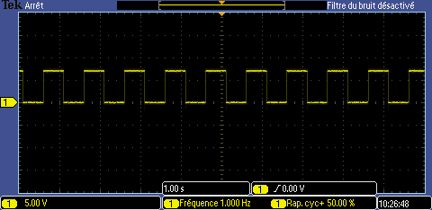
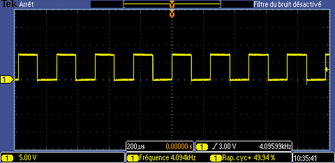

## I2C Real-Time Clock

### Pin configurations

Pin 1 - **X1** : Quartz  
Pin 2 - **X2** : Quartz  
Pin 3 - **VBAT** : Vcc battery  
Pin 4 - **GND** : Ground  
Pin 5 - **SDA** : Serial Data Input/Output  
Pin 6 - **SCL** : Serial Clock Input  
Pin 7 - **SQW/OUT** : Square Wave Output driver  
Pin 8 - **VCC**  

### How to use it

1. Connect the Quartz on pin 1 and 2
2. Connect pin 4 of Arduino(I2C) on SDA and pin 5(I2C) to SCL
3. SDA, SCL and SQW have to be connected to Vcc through pull-up resistors (min 2k)

### Code example

Import RTCLib into your arduino libraries directory and launch [Square wave output example](../../examples/DS1307_sqwout.ino)

### Signal output

#### 1 Hz 

#### 4.096 kHz

#### 8.192 kHz

