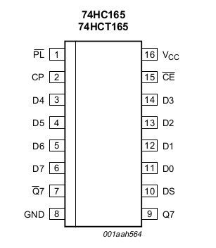

## 8-bit parallel-in/serial out shift register

### Pin configurations

Pin 1 - **PL** : asynchronous parallel load input (active LOW)  
Pin 2 - **CP** : clock input  
Pin 3 - **D4** : parallel data input 4    
Pin 4 - **D5** : parallel data input 5  
Pin 5 - **D6** : parallel data input 6  
Pin 6 - **D7** : parallel data input 7  
Pin 7 - **Q7** : complementary output from the last stage  
Pin 8 - **GND** :  ground    
Pin 9 - **Q7** : serial output from the last stage  
Pin 10 - **DS** : serial data input  
Pin 11 - **D0** : parallel data input 0  
Pin 12 - **D1** : parallel data input 1  
Pin 13 - **D2** : parallel data input 2  
Pin 14 - **D3** : parallel data input 3  
Pin 15 - **CE** : clock enable input (active LOW)  (with pull-down resistor)  
Pin 16 - **Vcc** : supply voltage  

### How to use it

PL is the latch pin. When it's HIGH, the shift register is listening to its 8 parallel inputs.  
When it's LOW, it is listening to the clock pin and passing information to the serial output.

CE must be activated through pull-down resistor.

The clock CP is the metronome of the conversation between the shift register and the Arduino.
Every time the Arduino sends the clock pin from LOW to HIGH, the shift register change the state
of the serial ouput pin to tell about the next switch.